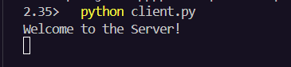
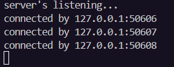
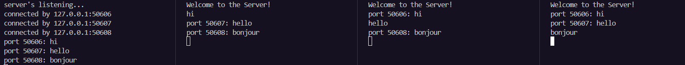
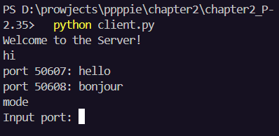
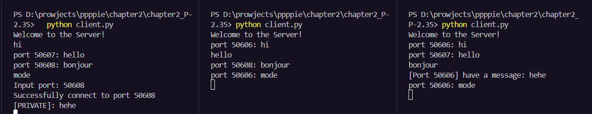
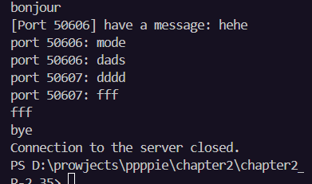
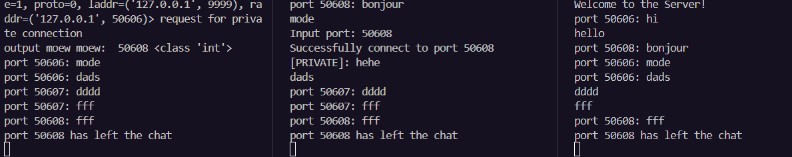
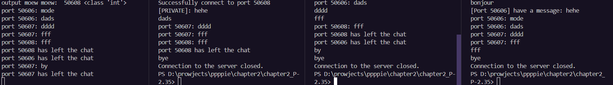

# My excuse for the unexpected project -

# From Alice & Bob network simulation -> an actual multithread TCP network program

> **P-2.35:**
> Write a set of Python classes that can simulate an Internet application in which one party, Alice, is periodically creating a set of packets that she wants to send to Bob. An Internet process is continually checking if Alice has any packets to send, and if so, it delivers them to Bob’s computer, and Bob is periodically checking if his computer has a packet from Alice, and, if so, he reads and deletes it.

The moment my eyes met the word "Internet application", I was immediately traumatised. Although my major relates to Computer Networks, I just understand that concept in theory; and creating a network program really overwhelmed my brain (at that time), and I find myself struggling a lot just from writing a few lines of code. But now, I realize that I have to face my fear, orelseishouldntexistinthiswor-

And yes, in order to recover my broken programming skill, ChatGPT did not exist in the helping (which makes me veryproudofmyse-), purely from my discovery on google, geeksforgeeks and stackoverflow (stckoverflow helps a loooooooooooot)

As the name describes itself, this is a server-multiclient TCP network program

### Overview

server is activated

when client is in action, server will send a message to inform that client has successfully connect to server

server print out addresses from all the clients that successfully connect to server

overview on how programs execute simultaneously

when client type "mode", server will interpret that client wants to connect to another client privately, then client will input the port client want to connect

 yeah it successed

when client wants to exist the chat, they type "bye"

others including server will receive a nofification

yeah that's it.
